# Hi, I'm Leandro Adrian! 👋

### Backend Developer | NestJS & Laravel Specialist

I'm a developer focused on building robust, scalable, and high-performance systems. I have hands-on experience modernizing legacy systems and designing event-driven architectures to process large volumes of data.

---

### 🛠️ Tech Stack

* **Languages & Frameworks:** PHP (Laravel, CodeIgniter), TypeScript (NestJS, Node.js)
* **Infrastructure & Messaging:** RabbitMQ, Redis, Docker, Kubernetes (K8s), MinIO
* **Databases:** PostgreSQL and MySQL
* **Practices:** SOLID principles and Clean Architecture

---

### 📫 How to reach me

* **Instagram:** [leandroadrian_](https://www.instagram.com/leandroadrian_)
* **LinkedIn:** [leandro-adrian](https://www.linkedin.com/in/leandro-adrian)
* **Email:** [leandrinsilva22@gmail.com](mailto:leandrinsilva22@gmail.com)

---

*"Turning complex business challenges into efficient, scalable, and well-documented code."*

## 📊 GitHub Stats

<picture>
  <source media="(prefers-color-scheme: dark)" srcset="profile/stats-dark.svg">
  <source media="(prefers-color-scheme: light)" srcset="profile/stats-light.svg">
  
</picture>

## 🧠 Top Languages

<picture>
  <source media="(prefers-color-scheme: dark)" srcset="profile/top-langs-dark.svg">
  <source media="(prefers-color-scheme: light)" srcset="profile/top-langs-light.svg">
  
</picture>
