# Olá, eu sou o Leandro Adrian! 👋

### Desenvolvedor Backend | NestJS & Laravel Specialist

Sou um desenvolvedor focado em construir sistemas robustos, escaláveis e de alta performance. Tenho experiência real 
em modernização de sistemas legados e criação de arquiteturas orientadas a eventos para processamento de grandes     
volumes de dados.

---

### 🛠️ Minha Stack Técnica

- **Linguagens & Frameworks:** PHP (Laravel, CodeIgniter), TypeScript (NestJS, Node.js).
- **Infraestrutura & Mensageria:** RabbitMQ, Redis, Docker, Kubernetes (K8s), MinIO.
- **Bancos de Dados:** PostgreSQL e MySQL.
- **Práticas:** SOLID e Clean Architecture.

### 📫 Como me encontrar

- **Instagram:** [leandroadrian_](https://www.instagram.com/leandroadrian_)
- **LinkedIn:** [leandro-adrian](https://www.linkedin.com/in/leandro-adrian)
- **Email:** leandrinsilva22@gmail.com

---

*"Transformando desafios complexos de negócio em código eficiente, escalável e bem documentado."*

## 📊 GitHub Stats

## 🧠 Top Languages

